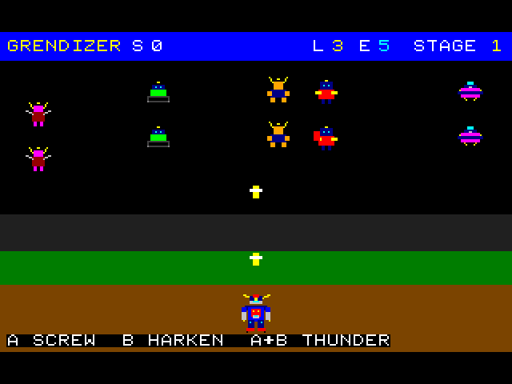

# Vega Assault

An unofficial, non-commercial, educational PRG32 C fan-game inspired by the world of Go Nagai's *UFO Robot Grendizer*. The cartridge combines an arcade-style finite-state machine, animated RGB565 sprites, Grendizer/Spazer transformations, Screw Crusher, Double Harken and Space Thunder, multiple enemy families, three terrain stages, boss-specific patterns, and an original stereo chiptune/SFX system.

All code, pixel art, waveforms, SFX, and musical patterns supplied by this repository are original project material. No anime frames, manga scans, production logos, commercial-game sprites, soundtrack recordings, or note-for-note transcriptions are included. Third-party names, characters, designs, and trademarks remain the property of their respective rights holders.



*Actual ESP32-C3 QEMU gameplay capture, including the host display bands, enlarged 2× without smoothing. See [QEMU validation](docs/qemu.md#observed-validation) and the [reproducible native capture](docs/graphics.md#gameplay-capture).*

## Educational purpose

The repository is intentionally written as a teaching artifact. Every nonblank C source line is accompanied by an `EDUCATIONAL` comment. The implementation emphasizes explicit finite-state machines, static arrays, deterministic integer logic, the PRG32 ABI, RGB565 graphics, compact audio sequencing, reproducible asset generation, and a hard cartridge-size budget. See [docs/educational_design.md](docs/educational_design.md).

## Controls

- D-pad: move in four directions
- A: Screw Crusher
- B: Double Harken
- A+B: Space Thunder (costs energy)
- START: start / pause / resume

## Prerequisites

PRG32 currently uses ESP-IDF 5.4 or newer. The physical host is ESP32-C6; desktop QEMU uses Espressif's ESP32-C3 RISC-V graphics path. Clone PRG32 first and verify the environment:

```sh
git clone https://github.com/riscv-prg32/PRG32
cd PRG32
python3 -m prg32 doctor
```

On Linux/macOS, install ESP-IDF for `esp32c3,esp32c6`; for QEMU also install Espressif `qemu-riscv32`. Windows users should use the ESP-IDF PowerShell/Command Prompt configured by Espressif.

## Step-by-step: compile the cartridge

From this repository:

```sh
PRG32_ROOT=/absolute/path/to/PRG32 ./build.sh
```

The audio packer rejects invalid sample loops, instrument references, pan values, unknown commands and overflowing event fields instead of silently changing the sound data. The script checks educational comments, compiles C99 with `-Wall -Wextra -Werror`, repacks audio, invokes the PRG32 portable cartridge builder, and rejects any final package larger than **131072 bytes**. Export the ESP-IDF toolchain first so `riscv32-esp-elf-gcc` is on PATH. In the configured local workspace, initialize the toolchain with `source /Users/raffaelemontella/esp-idf/export.sh` and use `PRG32_ROOT=/Users/raffaelemontella/devel/riscv-prg32/PRG32`. Sprite changes require `python3 tools/generate_assets.py` (Pillow required) before building. The script can be invoked from another directory; relative `OUT` paths are resolved against this repository, and absolute paths are supported. The cartridge exports `grendizer_c_init`, `grendizer_c_update`, and `grendizer_c_draw`.

## Step-by-step: run on QEMU

1. Export your ESP-IDF environment.
2. Install Espressif QEMU (`python "$IDF_PATH/tools/idf_tools.py" install qemu-riscv32` when needed), source ESP-IDF `export.sh` again, then run `python3 tools/check_qemu.py` from this repository. Generic QEMU may have the same executable name but lack the required `esp32c3` machine.
3. Build the PRG32 QEMU host:
   ```sh
   cd /path/to/PRG32
   python3 -m prg32 qemu build
   ```
4. Build this game using the command above.
5. Stage the resulting `.prg32` into QEMU flash:
   ```sh
   cd /path/to/PRG32
   python3 -m prg32 qemu upload /path/to/this-project/build/grendizer-vega-assault-86.prg32
   ```
6. Launch:
   ```sh
   python3 -m prg32 qemu run
   ```
7. Keep the terminal focused for input. Use arrows/WASD for direction, J/Z for A, and K/X for B.

Detailed rationale and troubleshooting context are in [docs/qemu.md](docs/qemu.md).

## Step-by-step: run on a real ESP32-C6

1. Install/export ESP-IDF with ESP32-C6 support.
2. Build and flash the resident PRG32 firmware to the ESP32-C6 using the upstream PRG32 hardware instructions (or its PlatformIO physical-board environment).
3. Build this game with `PRG32_ROOT=... ./build.sh`.
4. Connect to the running PRG32 host and determine its URL. A common setup/AP URL is `http://192.168.4.1`.
5. Upload the cartridge:
   ```sh
   cd /path/to/PRG32
   python3 -m prg32 esp32c6 upload /path/to/this-project/build/grendizer-vega-assault-86.prg32 --url http://192.168.4.1
   ```
6. To use a different slot, append `--slot cart1` (or another available slot).
7. Run the cartridge from PRG32 setup or select it as the default cartridge.
8. Validate physical buttons, display, audio, and all stages.

See [docs/esp32c6.md](docs/esp32c6.md) for the laboratory-oriented procedure.

## Publish on CartridgeStore

The repository contains Store artwork, a manifest template, a bundle builder, and a publication guide. After building and testing a genuine cartridge:

```sh
./publish-store.sh
```

The helper takes its default version from `store/manifest.template.json` (currently 1.1.0); `VERSION=...` overrides it. It uses the configured PRG32 tools to validate cartridge structure and ABI/memory requirements before creating a reproducible archive. Inspect `dist/`, then upload the generated ZIP to your CartridgeStore instance:

```sh
curl -X POST https://YOUR-STORE/api/publish/bundle \
  -H "Authorization: Bearer $PRG32_STORE_TOKEN" \
  -F bundle=@dist/grendizer-vega-assault-86-store-1.1.0.zip
```

Uploads enter the Store editor-review queue. Full instructions, architecture labeling rules, and release checks are in [docs/cartridge_store.md](docs/cartridge_store.md) and [STORE_PUBLISHING.md](STORE_PUBLISHING.md).

## Repository map

```text
src/                    line-by-line-commented C cartridge source
assets/                 generated sprite preview
audio/                  original compact waveform/SFX sources
build/                   packed audio block / generated build material
store/                   CartridgeStore manifest template and artwork
tools/                   reproducible sprite/audio/store tooling
docs/                    academic documentation set
AGENTS.md                contributor/agent invariants
build.sh                 cartridge build + 128 KiB gate
publish-store.sh         Store release-bundle helper
SIZE_BUDGET.md           storage budget
CHANGELOG.md              release history
LICENSE                   license for original project material
```

## Documentation

Start with [docs/index.md](docs/index.md). The documentation covers architecture, pedagogy, game design, graphics, audio, QEMU, ESP32-C6, testing, performance, reproducibility, CartridgeStore publication, and IP/ethics.

## Local verification

Run `sh tools/test_game.sh` for C99 gameplay regression tests with address and undefined-behavior sanitizers. The tests use the sibling PRG32 headers (or `PRG32_ROOT`) and mock portable input, graphics, and audio calls. They cover pause, terminal transitions, controls, weapons, all stage/boss transitions, deterministic restart, and enemy movement/firing fixes. Weapons require enough free slots for the entire attack before spending energy or starting cooldowns, and waves include all five enemy families. After building, run `python3 -m unittest discover -s tests -p 'test_*.py'` for audio validation and Store packaging regressions. See [docs/testing.md](docs/testing.md) for what still requires QEMU and hardware.

Sprites are stored as one-byte palette indices and expanded into a fixed RGB565 buffer before drawing. This preserves the artwork and fits the portable builder's separate **32768-byte executable RAM limit**. The measured package is **26336 bytes**, with **29188 bytes** of code/data/BSS; see [SIZE_BUDGET.md](SIZE_BUDGET.md).

## Cartridge-size rule

The final `.prg32` package must fit a PRG32 128 KiB slot: **<= 131072 bytes**. The build gate is authoritative; ZIP size and host-object size are not substitutes for measuring the final cartridge.

## License and attribution

The MIT license covers only original code and project assets in this repository. See [docs/ip_ethics.md](docs/ip_ethics.md) before redistribution.
