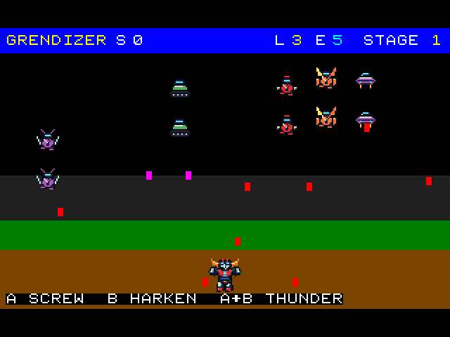
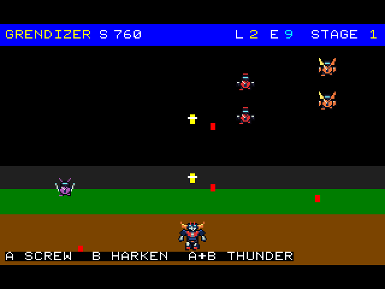
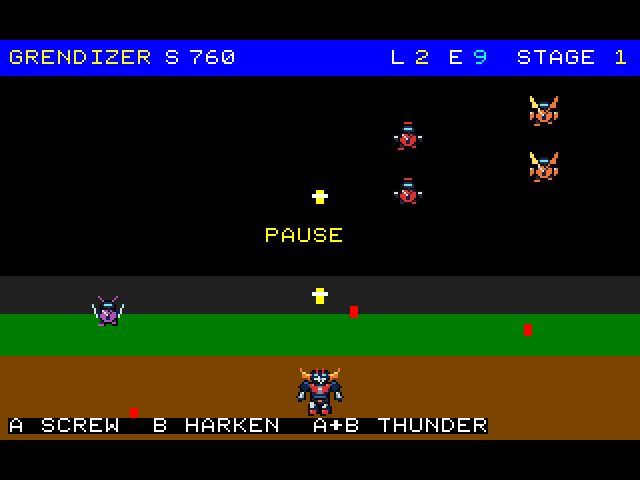
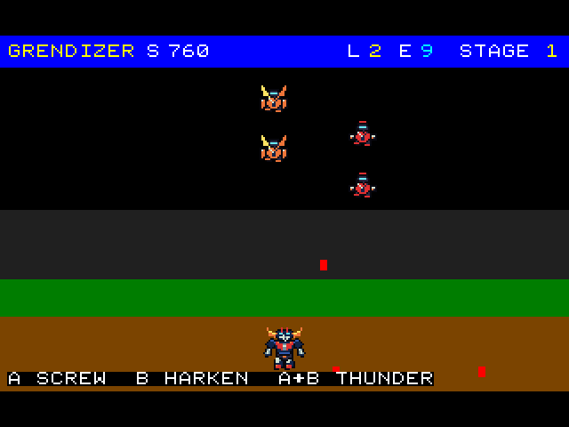

# Gamefield screenshots

These images show the refined sprites running in the actual ESP32-C3 QEMU host. They were captured from its 320×240 RGB565 framebuffer during the 2026-09-02 sprite smoke test and enlarged 2× using nearest-neighbor sampling. The host bands are retained. No entities, text or scene elements were composited into the captures.

## First-stage enemy wave

The player faces blade robots, crawlers, horned enemies and flying scouts. The HUD shows lives, energy and the current stage.

## Firing during combat

Screw Crusher projectiles travel through the enemy wave; the changed score and lives reflect the running game.

## Paused gamefield

START freezes the scene and displays the pause label over the gamefield.

## Resumed combat

A second START resumes play; enemy and projectile positions advance again.

## Provenance and reproduction

See the [QEMU smoke-test record](qemu.md#sprite-refinement-smoke-test-2026-09-02) for build sizes, framebuffer capture details and local raw evidence under `build/qemu-sprites/`. The README uses the first-stage wave capture. The committed gallery files are enlarged copies of the corresponding `gameplay.png`, `firing.png`, `pause.png` and `resume.png` captures. For a separate deterministic host-rendered view, run `python3 tools/capture_screen.py`; that output is `assets/gameplay.png` and is not a QEMU capture.

These screenshots demonstrate first-stage rendering and the tested inputs. They do not establish later-stage/boss playthrough coverage or physical ESP32-C6 behavior. The [sprite sheet](../assets/sprite-sheet.png) documents all 24 art frames, while the Store splash is a promotional composition generated from those frames.
